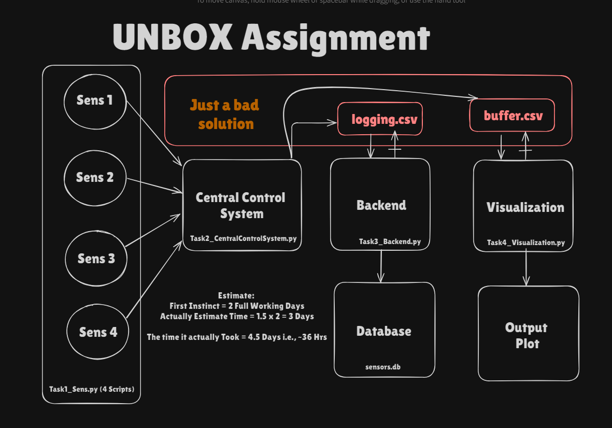

# RSE002 - Gaurav Khaire

I tried to have as less dependencies as possible  
Dependencies: paho-mqtt, matplotlib   
`pip install paho-mqtt matplotlib` 

Downloads: mosquitto -> [https://mosquitto.org/download/](https://mosquitto.org/download/)  

References:  
 TCP -> [https://www.neuralnine.com/tcp-chat-in-python/](https://www.neuralnine.com/tcp-chat-in-python/)  
MQTT -> [https://medium.com/@potekh.anastasia/a-beginners-guide-to-mqtt-understanding-mqtt-mosquitto-broker-and-paho-python-mqtt-client-990822274923](https://medium.com/@potekh.anastasia/a-beginners-guide-to-mqtt-understanding-mqtt-mosquitto-broker-and-paho-python-mqtt-client-990822274923)  

Design Doc:  

